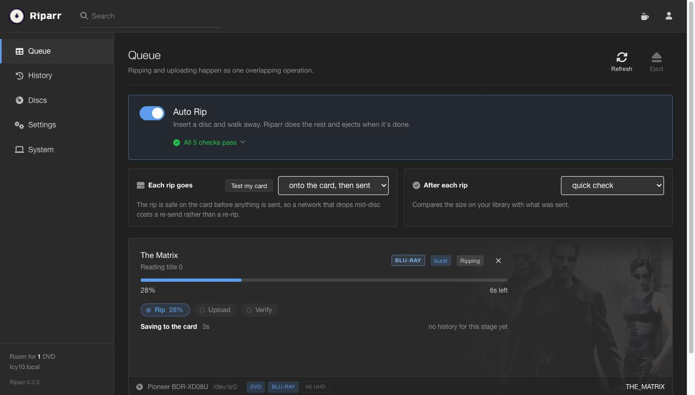
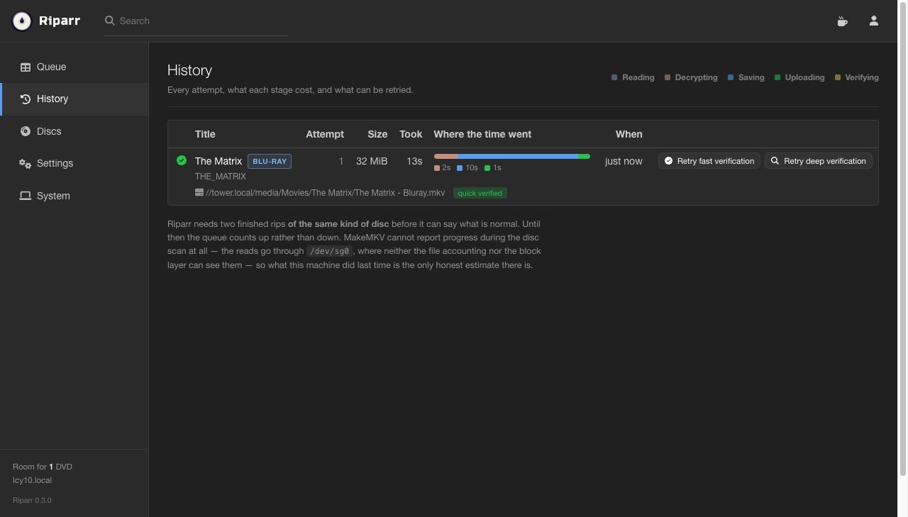
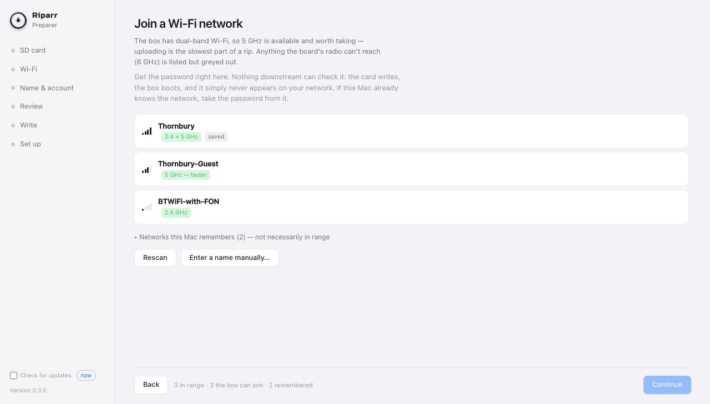
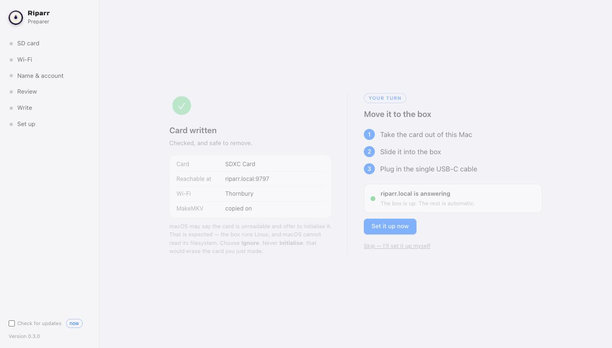

<div align="center">


# Riparr

**Rip your Blu-rays and DVDs straight onto your NAS. One box, one cable, no babysitting.**

[Get it](#get-it) · [User guide](docs/guide/README.md) · [Which drive to buy](docs/guide/01-what-you-need.md#which-drive) · [Troubleshooting](docs/guide/08-troubleshooting.md)

</div>

---

Sonarr does your TV. Radarr does your films. Nobody bothered automating the boring part:
getting the discs off your shelf and into your library. That's this.

It's a 3D-printed box with an optical drive and a little single-board computer inside.
**One USB-C cable** runs the whole thing. No screen, no keyboard, no power button. Once
it's set up you don't touch the software again:

> **put a disc in → close the tray → walk away → it ejects when it's done**

The MKV lands on your share, named the way Plex and Jellyfin want it. The disc comes back
out when it's done, which is all the status you need most days — `riparr.local` in a
browser is there for when you want detail.

---

## What it looks like

**Using it.** A disc going through, and the same disc afterwards.





**Setting it up.** The Preparer runs on your computer and writes the SD card.





---

## Get it

Download the Preparer for whatever you're sitting at. Everything else happens from there.

| | | |
|---|---|---|
| **macOS** | `riparr-preparer-macos.dmg` | Open it, drag Riparr Preparer into Applications |
| **Windows** | `riparr-preparer-windows-beta.exe` | Double-click it |
| **Linux** | `riparr-preparer-linux-beta.tar.gz` | Unpack it, run `Riparr Preparer` |

**[→ Latest release](../../releases/latest)**

None of it is code-signed yet, so both will block it the first time.

**macOS:** double-click it and let it get refused. Then go to **System Settings → Privacy
& Security**, scroll to the bottom, and click **Open Anyway** next to the line about
Riparr Preparer. One more dialog, click Open, and that's it — it won't ask again.

**Windows:** More info → Run anyway.

---

## How it goes

**1 · Write the card.** About five minutes, on your computer.
Pick the SD card, pick your Wi-Fi, name the box. It downloads the OS, writes the card,
then reads it back to check it kept what was written.

**2 · Plug it in.** About ten minutes, hands off.
Card into the box, cable into the wall. The Preparer watches the network and unlocks the
next button the moment the box actually shows up, then installs everything over SSH. Go
and do something else.

**3 · Use it.** Forever.
Open `riparr.local`, point it at your share, put a disc in.

---

## What you'll need

| | |
|---|---|
| **A board** | Orange Pi Zero 2W is what I built it on. Others are in there, some still marked beta |
| **An optical drive** | USB, or internal plus a bridge that actually *says* it does optical/ATAPI. [This is the bit people get wrong](docs/guide/01-what-you-need.md#which-drive) |
| **An SD card** | Cheapest one that holds the OS. Riparr uses about 2.3 GB, so **8 GB works** and 16 GB is comfortable. Rips go to your NAS, not the card — bigger cards just buy you a bigger buffer |
| **A share** | SMB. Any NAS, or a folder on a computer that's usually on |
| **Doing 4K UHD?** | That's a *drive* decision, not a setting. [Read this before you buy](docs/guide/01-what-you-need.md#which-drive) |

---

## Keeping it updated

Both halves watch for new releases and say so. Nothing installs until you click.

The web interface updates the box. The Preparer updates itself. And if the box's own
updater ever can't manage it, run the Preparer's **Set up a box that's already running** —
it updates in place over SSH and your login, settings, rip history and MakeMKV build all
stay exactly where they are.

---
---

# Deeper details

Everything below is stuff you probably don't need. It's here if you do.

## Where it's at

This is pre-1.0. It rips discs end to end on real hardware, and both halves update
themselves. It has also run on one board, with one drive, against one NAS — so the parts
most likely to bite you are the ones fewest people have tried: other boards, other
drives, and **writing a card from Windows or Linux**, which is written and tested but
hasn't yet produced a card that went on to boot a board. If you're first, [an issue](../../issues)
with your OS version and card reader is genuinely useful.

Deliberate limits, so they don't surprise you:

- **The MakeMKV beta key expires monthly.** That's GuinpinSoft's call, not mine. Riparr
  fetches the current one, tells you when yours lapses, and makes replacing it one click.
- **No transcoding.** A board this size would take days and it'd look bad. Write to a
  watch folder and let Tdarr or Unmanic do it properly.
- **Rips transfer when they finish**, not while they're being written. Writing *straight*
  to your library is built and is a setting — on the reference board it's faster than the
  card, and it takes the card out of the size equation.

## Run it from source

```sh
# On the box, from a checkout
sudo bash tools/install.sh          # → http://riparr.local:9797

# On your own machine, just to poke at the interface
cd server && python3 -m venv .venv && .venv/bin/pip install -r requirements.txt
RIPARR_MOCK=1 .venv/bin/python -m uvicorn riparr.main:app --port 9797

# The Preparer, from a checkout
pip install -r tools/preparer/requirements.txt
python3 tools/preparer/shell.py
```

## Documents

- **[User guide](docs/guide/README.md)** — what to buy, how to set it up, what to do when it sulks
- **[Design notes](docs/design/)** — why things work the way they do

## Support

Bugs and ideas: **[Issues](../../issues)**.

## Licence

**[GPL-3.0](LICENSE)** — same as Sonarr, Radarr and the rest of the family, and for the
same reason: the interface is built on Sonarr's design tokens, and copyleft comes along
with them. Use it, change it, pass it on. If you pass it on, ship the source too.

| | |
|---|---|
| Design tokens | [Sonarr](https://github.com/Sonarr/Sonarr) — GPL-3.0 |
| Themes | [theme.park](https://github.com/themepark-dev/theme.park) — MIT |
| Icons | [Font Awesome Free](https://fontawesome.com/license/free) — CC BY 4.0 · brand marks from [Simple Icons](https://simpleicons.org/) — CC0 |
| Wordmark | [Russo One](server/static/fonts/RussoOne-OFL.txt) — SIL OFL 1.1 |
| Window shell | [pywebview](https://pywebview.flowrl.com/) — BSD-3-Clause |
| Disc reading | [MakeMKV](https://www.makemkv.com/) — proprietary, by GuinpinSoft. **Not shipped with Riparr.** Your box downloads it during setup and you accept their terms yourself. makemkv.com goes down for weeks at a time, so Riparr keeps a list of mirrors and tries them in order — every one is checked against a hash pinned in this repo, so a mirror can't hand you the wrong thing |

Riparr isn't affiliated with or endorsed by Sonarr, Radarr, GuinpinSoft or anyone else
named here. Those names belong to them.

## On AI

I built this with a lot of help from an AI coding assistant, working against real
hardware and my own design decisions. Saying so plainly because I'd want to know, and
"did a machine write this" is a fair question about anything you're going to run on your
own network.

The decisions are mine, the bugs are mine, and nothing shipped because it looked right —
the claims in here are the ones that were actually run. If you'd rather not run software
built this way, that's completely fair, and this paragraph is here so you can decide
before you install anything.
